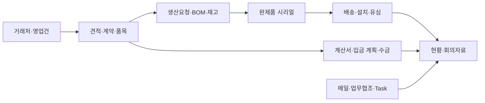

# TOVNET | 현장 업무에서 서비스로

제조·영업 업무를 연결하는 **MES**와 CCTV 분석을 현장 모니터링으로 발전시킨 **TOVNET-SEG·탄천 프로젝트**의 개발 포트폴리오입니다. 기능 목록뿐 아니라, 어떤 문제에서 출발해 무엇을 연결하고 개선했는지를 기록합니다.

| 포트폴리오 | 시작점 | 현재까지의 발전 |
|---|---|---|
| [MES 통합 업무 플랫폼](mes-portfolio/) | MAIN/SUB 업무·주간보고·A/S와 제조 관리 | 영업 → 견적·계약 → 생산·시리얼 → 배송·설치 → 수금·회의자료를 연결하는 업무 흐름 |
| [TOVNET-SEG · 탄천 현장 AI 모니터링](tovnet-seg-portfolio/) | AI 영상 분석·모니터링 시스템 설계·개발과 중간발표 | 영상·마스크 안정화, 재학습, 시계열 예측, 센서·관제·알림 통합 |

## 01. MES — 업무 화면에서 부서 간 연결로

최신 설명은 **2026-09-29 확인한 다운로드 v2 소스**를 기준으로 합니다. 이전 Git 개발본에 없던 생산요청·반제품 BOM·위치 재고·계약서·부서 대시보드와, 확장된 영업·유심·메일 기능을 반영했습니다.

- **영업·회계:** 국내/해외 영업, 견적·계약·납품 문서, 계산서 예정과 입금·미수금
- **생산·재고:** 품목·옵션·반제품 BOM, 창고/캐비닛/칸, 생산완료와 재고·S/N 연결
- **현장 관리:** 배송·설치·대여, 유심 설치 이력과 반납, 시리얼 역추적
- **협업:** 메일의 업무협조 전환, 화면 항목의 Task 등록, 주간보고·영업회의 취합

[개발 과정과 실제 연결 사례 보기](mes-portfolio/README.md) · [최신 v2 기능 근거](mes-portfolio/DEVELOPMENT_UPDATE.md)

## 02. TOVNET-SEG · 탄천 — 하나의 프로젝트, 두 단계

양호용이 AI 영상 분석부터 웹 모니터링까지 전체 시스템의 설계·개발을 담당했습니다. AI 엔진·탄천 웹·센서·현장 네트워크를 같은 시스템을 발전시킨 과정으로 묶었습니다.

| 단계 | 핵심 질문 | 과정 |
|---|---|---|
| [1. 중간발표까지](tovnet-seg-portfolio/01-before-interim.md) | 영상 분석 시스템을 어떻게 구현할 것인가? | 모델 적용·추론 파이프라인·현장 영상 연결 개발, 성능 비교와 중간발표 |
| [2. 중간발표 이후](tovnet-seg-portfolio/02-after-interim.md) | 현장에서 지속적으로 쓰려면 무엇을 바꿔야 하는가? | 영상·마스크 안정화 → 플랫폼·센서 연동 → 측정값·예측 → 오탐 수집·재학습·검증 |

[전체 개발 여정 보기](tovnet-seg-portfolio/README.md)

## 이전 결과물과 확인 범위

- [Laravel USIM 코드](usim-management-portfolio/)는 MES 내부 유심 모듈로 확장되기 전의 별도 구현 기록입니다.
- 기존 PDF·PPTX·이미지는 당시 결과물로 보존하며, 최신 설명과 구분합니다.
- 실제 설정·고객 자료·영상·모델 가중치 없이 업무 흐름, 구조, 집계 평가와 선별 예제를 공개합니다.
- MES의 협업 범위와 탄천의 전체 설계·개발 담당 역할은 각 포트폴리오에 명시합니다.

[2026-09-29 반영 근거](docs/UPDATE_2026-09-29.md)
