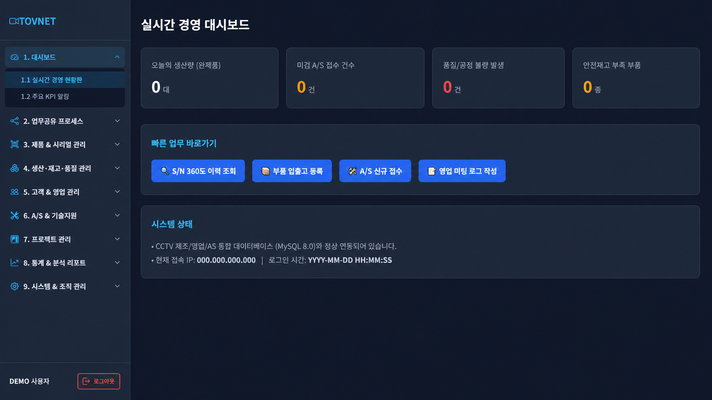
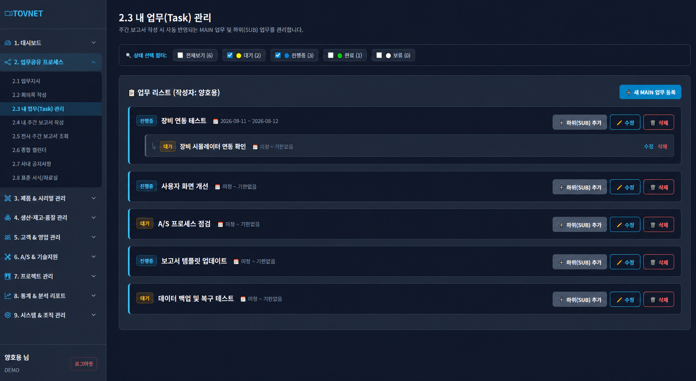
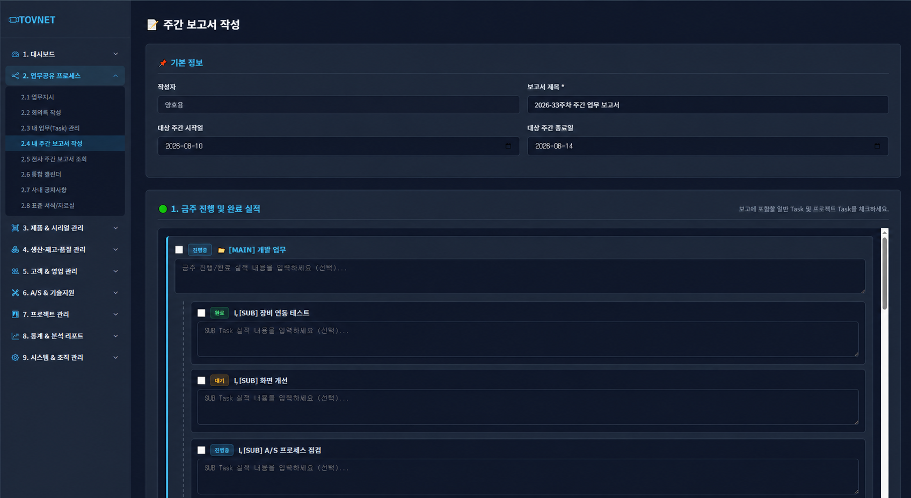
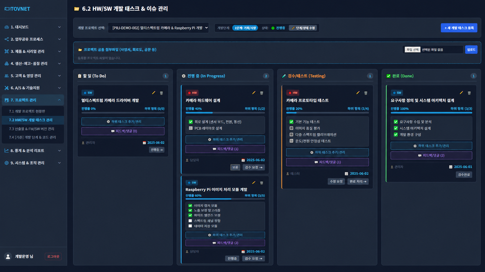

# PHP 기반 MES · 업무공유 · 고객 A/S 통합 관리 플랫폼



제조업체의 제품·부품·BOM·생산·재고·품질·시리얼 번호 정보와 사내 업무공유, 주간보고, 고객 A/S, HW/SW 개발 프로젝트를 하나의 웹 시스템에서 관리하기 위해 개발 중인 플랫폼입니다.

## Portfolio Files

- [발표자료 PDF](MES_업무관리_포트폴리오_양호용.pdf) - GitHub에서 바로 열람
- [발표자료 PPTX](MES_업무관리_포트폴리오_양호용.pptx) - 원본 슬라이드 다운로드
- `PRESENTATION_SCRIPT.md` - 발표·면접용 설명
- `assets/` - 실제 구현 화면의 공개용 이미지

## Project Overview

| 구분 | 내용 |
|---|---|
| 상태 | 개발 진행 중 |
| 개발 형태 | 제조업 실무 경험이 있는 사수와 2인 협업 |
| 개인 중심 역할 | 업무공유, MAIN/SUB 업무, 주간보고, 고객 A/S 프로세스 |
| 공동 역할 | 프로젝트 관리, HW/SW 개발 태스크 관리, Git 통합 |
| 사수 주도 | 공장 납품, 시리얼 번호, 생산·재고 등 제조 도메인 프로세스 |
| Backend | PHP, Session, PDO |
| Database | MySQL/MariaDB |
| Frontend | HTML, CSS, JavaScript, Bootstrap 5, Fetch API |
| Collaboration | Git, GitHub |

> 코드에 작성자 표기가 없어 개별 파일의 단독 소유권을 주장하지 않습니다. 역할은 실제 협업 과정에서 확인된 범위로 구분했습니다.

## 실제 구현 화면

화면 구조와 기능은 실제 개발 시스템을 기준으로 합니다. 공개 저장소에 적합하도록 접속 IP와 일부 내부 업무명만 예시 데이터로 변경했습니다.

### 1. 실시간 경영 대시보드


- 오늘의 완제품 생산량
- 미결 A/S 접수 건수
- 품질·공정 불량 발생 건수
- 안전재고 부족 부품
- 시리얼 이력조회, 부품 입출고, A/S 접수 등 빠른 업무 이동
- 시스템과 DB 연결 상태 확인

### 2. MAIN/SUB 업무 관리



제가 중심적으로 참여한 업무공유 기능입니다.

- MAIN 업무와 SUB 업무의 계층형 구성
- 대기·진행·완료·보류 상태 필터
- 담당자, 기간, 진행 상태와 진척도 관리
- 업무 수정·삭제와 하위 업무 추가
- 댓글·첨부파일을 통한 협업 기록
- 주간보고 작성 시 기존 업무 자동 연결

### 3. 주간보고 작성



- 작성자와 대상 주차 관리
- 기존 MAIN/SUB 업무 선택
- 금주 진행·완료 실적 입력
- 차주 계획과 미완료 업무 연결
- 업무 데이터와 보고 내용의 일관성 확보
- 중복 입력을 줄이고 회의·피드백에 활용

### 4. HW/SW 프로젝트 칸반



프로젝트 관리 기능은 사수와 공동 개발하고 있습니다.

- To Do / In Progress / Testing / Done 칸반 상태
- HW/SW 작업 유형 구분
- 진행률과 하위 태스크 체크리스트
- 피드백·댓글과 공통 첨부파일
- 검수 요청, 완료 처리, 상태 변경
- Raspberry Pi·멀티스펙트럼 카메라 개발 작업 관리

## System Architecture

```text
Browser
  ↓
Bootstrap 5 + JavaScript + Fetch API
  ↓
PHP Web Application + Session
  ↓
PDO / Prepared Statement
  ↓
MySQL / MariaDB
```

약 40개 테이블을 사용하는 구조로 사용자·권한, 제품·부품·BOM, 창고·재고·시리얼, 생산·불량, 업무·프로젝트, 주간보고, 고객·A/S 데이터를 관리합니다.

## Key Modules

### 제조·기준정보

- 제품 마스터
- 부품 마스터
- BOM 마스터
- 소모품 마스터
- 기준코드 관리

### 생산·재고·품질

- 작업지시와 조립 등록
- 부품·소모품 입출고
- 창고와 완제품 재고
- 불량 등록과 품질 이력
- 시리얼 번호 검색 및 제품 이력 추적

### 업무공유

- 업무지시와 개인 업무관리
- MAIN/SUB 업무 구조
- 회의록과 공지사항
- 주간보고 작성·조회
- 통합 캘린더와 자료실

### 고객·A/S

- 고객·판매정보 관리
- 시리얼 번호 기반 제품 확인
- A/S 신규 접수와 처리 상태
- 고객·제품·처리 이력 연결

### 프로젝트 관리

- 프로젝트 현황판
- HW/SW 개발 태스크 칸반
- 하위 태스크·진척도·댓글·첨부파일
- 검수와 완료 상태 관리

### 시스템 관리

- 사용자·부서 관리
- 역할별 권한
- 감사 로그
- 세션 인증

## Backend & Data Integrity

- PDO Prepared Statement로 SQL Injection 위험 감소
- `password_hash`, `password_verify` 기반 비밀번호 처리
- 로그인 CSRF 검증
- Session 기반 사용자 인증
- 재고·생산 데이터 변경 시 Transaction 적용
- 동시 수정 가능성이 있는 영역에서 `SELECT ... FOR UPDATE` 사용
- Git으로 기능 변경사항과 통합 과정 관리

트랜잭션과 행 잠금이 적용된 제조 영역은 프로젝트 공통 구현으로 확인했으며 개인 단독 성과로 주장하지 않습니다.

## Contribution Boundary

### 양호용 중심

- 업무공유 프로세스 설계·개선
- MAIN/SUB 업무와 상태 관리
- 주간보고와 기존 업무 연결
- 고객 A/S 처리 흐름 검토·개발
- 실제 사용 흐름을 고려한 화면 개선

### 사수 주도

- 공장 납품 프로세스
- 시리얼 번호 체계
- 제품·생산·재고 업무 규칙
- 제조업 현장 요구사항 정의

### 공동 개발

- 프로젝트 관리 기능
- HW/SW 개발 태스크 관리
- 기능 우선순위와 개발 방향 협의
- Git 기반 변경사항 공유와 통합

## Current Status & Next Steps

현재 주요 화면과 핵심 로직을 구현하면서 실제 사용 흐름에 맞게 다음 사항을 보완하고 있습니다.

- 권한별 메뉴와 기능 접근 범위
- 입력 항목과 업무 상태 전환 흐름
- 제조·시리얼·고객·A/S 데이터 연결
- 예외 처리와 사용자 안내
- 테스트 데이터 정비
- 현장 사용자 피드백 반영
- 배포와 운영 안정화

## What I Can Contribute

- PHP·MySQL 기반 업무 시스템의 프론트엔드와 백엔드를 함께 이해합니다.
- 현장 담당자의 설명을 화면·데이터·업무 상태로 구체화할 수 있습니다.
- 업무 데이터가 보고와 고객 대응까지 연결되는 전체 프로세스를 설계합니다.
- 제조 도메인 전문가와 협업하면서 요구사항을 정리하고 Git으로 기능을 통합한 경험이 있습니다.
- 웹·DB 시스템과 Raspberry Pi·카메라·AI 프로젝트를 연결하는 현장형 R&D에 관심이 있습니다.

## Privacy Notice

DB 접속정보, 비밀번호, 토큰, 실제 서버 IP, 고객 연락처와 개인 계정정보는 공개하지 않습니다. 시스템 기능, 화면 구조, 기술 스택과 공개 가능한 개발 내용은 포트폴리오 설명을 위해 유지했습니다.
