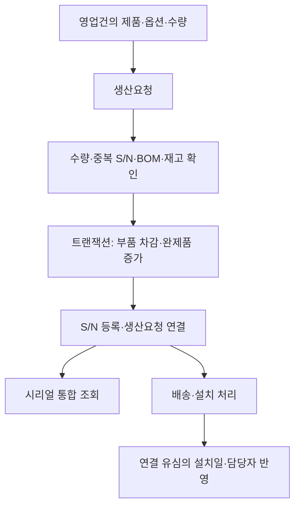
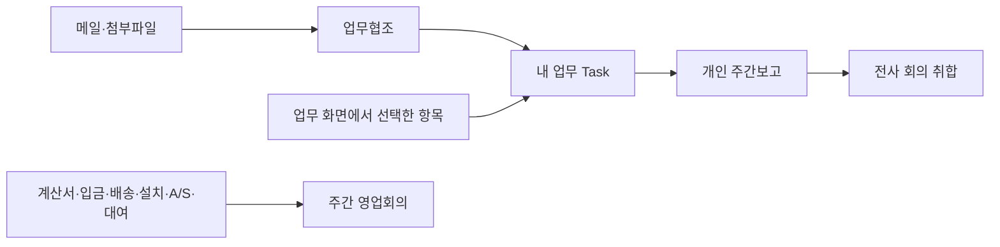

# MES | 제조·영업·현장·협업을 연결하는 통합 업무 플랫폼

처음에는 제조 정보와 사내 업무·주간보고·A/S를 한곳에서 관리하는 데서 출발했습니다. 최신 v2는 **한 영업건이 계약·생산·납품·설치·수금으로 이어지고, 그 결과가 담당자의 업무와 회의자료에 다시 연결되는 시스템**으로 확장됐습니다.

> 최신 기준: 2026-09-29 확인한 다운로드 v2. 이전 private Git의 2026-08-26 버전만으로 설명했던 내용을 최신 소스로 대체했습니다. 이 페이지의 연결 흐름은 코드를 확인한 내용이며 운영 DB를 실행한 결과는 아닙니다.

## 개발 과정 한눈에 보기

| 단계 | 해결하려던 문제 | 구현 방향 |
|---|---|---|
| 1. 업무와 제조 정보 정리 | 업무 상태·주간보고·제품·A/S 기록이 분산됨 | MAIN/SUB 업무, 주간보고 연결, 제조·재고·시리얼, 프로젝트 칸반 |
| 2. 영업 업무 확장 | 계약마다 문서·품목·입금·처리 상태를 따로 관리함 | 거래처 → 영업건 → 단계 구조, 견적·계약·계산서·입금·납품 기록 |
| 3. 생산·현장 연결 | 영업에서 요청한 제품이 생산·설치·유심과 끊어짐 | 영업 품목의 생산요청 연결, S/N 발급, 설치와 유심 이력 연동 |
| 4. 부서별 활용 | 담당자가 회의와 현황판을 다시 작성해야 함 | 부서 대시보드, 주간 영업회의 자동 취합, 화면 → Task → 보고 흐름 |

이는 구현의 발전 흐름을 정리한 단계이며, 개별 기능의 개발 날짜를 추정한 일정표는 아닙니다.

## 1. 초기 기반 — 업무공유·제조·A/S

MAIN 업무 아래 SUB 업무를 두고 담당자·기간·진척도·대기/진행/완료/보류 상태를 관리했습니다. 등록한 업무를 주간보고에서 선택해 실적과 다음 계획으로 연결하고, HW/SW 프로젝트에는 하위 태스크·댓글·첨부파일·검수 상태를 구성했습니다.

제품·부품·BOM·재고·시리얼과 고객 A/S를 함께 관리하면서, 업무를 기록하는 화면과 제조 이력을 조회하는 기반을 마련했습니다.

초기 구현 화면과 발표자료

아래 이미지는 이전 구현 시점 자료입니다. 최신 v2 화면으로 재촬영한 이미지는 아닙니다.

[기존 발표 PDF](MES_업무관리_포트폴리오_양호용.pdf) · [기존 PPTX](MES_업무관리_포트폴리오_양호용.pptx)

## 2. 최신 v2 — 영업건을 중심으로 문서·수금 연결

국내·해외 영업은 공통 화면 로직을 사용하면서 데이터 영역을 나눕니다. 영업건별로 단계·체크리스트·메모를 관리하고, 같은 건 안에서 다음 정보를 연결합니다.

- **품목:** 제품 옵션, 필요한 유심·시리얼, 생산요청과의 연결
- **견적·계약:** 품목별 견적, 계약서 편집, 견적 품목 가져오기, 조항·특약 템플릿
- **납품 문서:** 납품확인서 작성과 인쇄·Word 출력 경로
- **계산서:** 발행 예정, 월별 정기 일정, 발행 문서 등록, 취소·변경 이력
- **수금:** 계산서별 일시불/분할 입금 계획, 실제 입금 누적, 미수금과 임박 일정
- **현장 처리:** 배송·설치·대여와 기타 첨부파일, 처리 타임라인

단순히 계약 금액 하나를 적는 구조에서 **“무엇을 청구했고, 언제 얼마가 들어왔고, 무엇이 남았는가”**를 계산서·입금 기록으로 따라갈 수 있는 구조로 발전했습니다. 계산서의 시스템 내 등록·관리를 말하며 전자세금계산서 외부 발행 API 연동을 뜻하지 않습니다.

## 3. 영업 → 생산 → 시리얼 → 설치

```mermaid
flowchart TD
    A[영업건의 제품·옵션·수량] --> B[생산요청]
    B --> C[수량·중복 S/N·BOM·재고 확인]
    C --> D[트랜잭션: 부품 차감·완제품 증가]
    D --> E[S/N 등록·생산요청 연결]
    E --> F[시리얼 통합 조회]
    E --> G[배송·설치 처리]
    G --> H[연결 유심의 설치일·담당자 반영]
```

생산완료는 상태값만 변경하는 처리가 아닙니다. 생산 수량과 입력 시리얼 개수·중복을 검사한 뒤, 옵션별 BOM으로 부품을 차감하고 완제품 재고와 S/N을 등록하는 코드가 있습니다. 완료 취소에도 재고·시리얼 정리 경로와 이미 사용된 시리얼에 대한 제한을 두었습니다.

**품목·재고 구조도 확장됐습니다.**

- 제품·부품·소모품·반제품과 옵션을 통합 품목 화면에서 관리
- 반제품에 다른 반제품을 포함하는 중첩 BOM과 순환참조 검사
- 창고 → 캐비닛 → 선택적 칸의 위치별 재고
- 조립 등록의 투입·결과 재고와 위치 이력
- 생산요청·시리얼을 기준으로 관련 제품·유심·BOM 조회

위치별 재고와 창고 합계 재고가 함께 남아 있고, 생산요청 완료 코드는 창고 합계 재고를 사용합니다. 모든 경로가 위치 재고까지 완전히 통합됐다고 표현하지 않습니다.

## 4. 유심을 상태 목록에서 현장 이력으로

최신 MES 유심 모듈은 사용중·일시정지·해지 외에도 **어디에, 어떤 장치와, 누가 관리하는 상태로 설치됐는지**를 추적합니다.

- 라우터/모뎀과 카메라 완제품 S/N을 구분하여 연결
- 설치 위치·고객사·장치·담당자·설치일 변경 시 이력 보존
- 과거 배치 상태로 복원할 때 기존 이력을 지우지 않고 새 기록 추가
- 대여·반납·예정일과 미반납 상태 관리
- 설치 완료 기록에서 연결된 유심의 설치일·담당자 갱신
- 영업건·품목·시리얼 화면으로 서로 이동

[기존 Laravel USIM 프로젝트](../usim-management-portfolio/)와 최신 MES 내부 PHP 모듈은 별도 구현입니다.

## 5. 메일·현장 기록을 업무와 회의로 연결

```mermaid
flowchart LR
    M[메일·첨부파일] --> W[업무협조]
    W --> T[내 업무 Task]
    P[업무 화면에서 선택한 항목] --> T
    T --> R[개인 주간보고]
    R --> A[전사 회의 취합]
    S[계산서·입금·배송·설치·A/S·대여] --> C[주간 영업회의]
```

메일 상세에서 업무협조를 생성하고 첨부파일을 연결하는 처리, 완료된 업무협조를 Task로 이어주는 코드, 화면의 선택 항목을 Task로 등록하는 기능이 있습니다. 주간 영업회의는 미발행 계산서·미수금·설치/배송·A/S·대여를 취합하고, 담당자가 이번 주 현황과 다음 할 일을 더해 인쇄할 수 있게 구성했습니다.

메일 자체도 MIME 본문·첨부 해석, 자동 분류 규칙, 편집·임시저장 경로로 확장됐습니다.

## 6. 같은 데이터를 부서별 관점으로

| 화면 | 보여주는 업무 |
|---|---|
| 영업 대시보드 | 진행 영업건, 예상 금액, 신규 계약, 계산서 미발행·미수 |
| 생산 대시보드 | 생산량, 요청 처리, 안전재고, 불량, 발주 지연 |
| 연구소 대시보드 | 프로젝트·태스크 완료율, 마감 지연·긴급 항목 |
| 회계 대시보드 | 계산서 발행, 입금, 미수금, 입금 예정 |

회계 화면은 매출·수금 중심입니다. 지출·예산·회계 결산까지 갖춘 ERP로 설명하지 않습니다.

## 기술 구성과 역할

| 구분 | 내용 |
|---|---|
| 서버·데이터 | PHP, PDO, MySQL/MariaDB, 세션 인증 |
| 화면 | HTML/CSS/JavaScript, Fetch API, 자체 모달과 **일부 화면의 Bootstrap 5 혼용** |
| UI 도구 | flatpickr, FullCalendar 등 화면별 도구 |
| 데이터 처리 | 생산 처리의 트랜잭션·행 잠금, BOM 순환 검사, 변경 이력 |
| 배포 기록 | 기존 개발 문서상 FTP 배포 후 Git 수동 동기화 |

기존 협업 구분상 개인 중심 영역은 업무공유·MAIN/SUB·주간보고·A/S이고, 제조 도메인은 사수 주도, 프로젝트 관리는 공동 개발입니다. 최신 기능 전체를 단독 성과로 덧붙이지 않고 프로젝트의 발전 범위로 기록합니다.

[최신 소스 기능 근거·이전 버전 비교](DEVELOPMENT_UPDATE.md) · [구체적인 업무 연결 사례](WORKFLOWS.md) · [발표 설명](PRESENTATION_SCRIPT.md)

## 확인 범위

원본 v2는 읽기만 했으며 서버·DB·FTP를 실행하거나 변경하지 않았습니다. 다운로드 시점과 실제 배포 상태는 구분합니다. 접속 설정, 실명·연락처, 계약·메일·첨부 원자료는 공개하지 않습니다.
