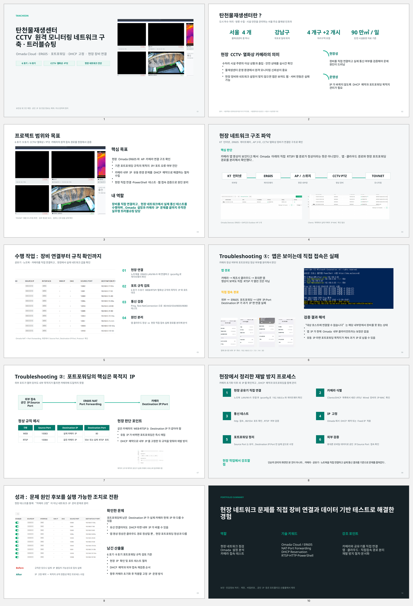

# 탄천물재생센터 CCTV 원격 모니터링 네트워크 구축·트러블슈팅

## 프로젝트 개요

탄천물재생센터 6호기·9호기 구간의 CCTV, PTZ, 열화상 카메라 원격 모니터링 환경을 점검한 현장 네트워크 프로젝트입니다. 카메라와 공유기, 노트북을 직접 연결하고 Omada Cloud, ER605 게이트웨이, 포트포워딩, DHCP 환경을 확인하며 영상 접속 장애의 원인을 단계적으로 분리했습니다.

## 수행 내용

- 현장 카메라·공유기·노트북 직접 연결 및 통신 구조 확인
- Omada Cloud에서 ER605 게이트웨이와 AP 상태 점검
- 6호기·9호기 WEB/RTSP/열화상 포트포워딩 규칙 검토
- `ipconfig`, `ping`, `arp`, `Test-NetConnection`을 활용한 네트워크 진단
- 앱 클라우드 영상 경로와 현장 직접 접속 경로 분리 분석
- 유동 내부 IP로 인한 포트포워딩 목적지 불일치 가능성 도출
- DHCP 예약 및 고정 IP 운영 절차 수립
- 카메라 초기화 이후 IP·MAC 식별, 포트포워딩 재설정, 외부 검증 절차 정리

## Troubleshooting 핵심

### 1. 앱에서는 영상이 보이지만 웹·서버에서는 접속 실패

휴대폰 앱은 제조사 클라우드를 통해 영상을 받을 수 있으므로, 앱 영상이 정상이라고 해서 현장 공유기의 WEB/RTSP 직접 접속 경로까지 정상인 것은 아닙니다. 두 경로를 분리해 카메라 고장과 네트워크 설정 문제를 구분했습니다.

### 2. 유동 IP와 포트포워딩 목적지 불일치

카메라가 DHCP로 새 내부 IP를 할당받으면 기존 포트포워딩 규칙은 과거 IP를 계속 참조할 수 있습니다. 이에 따라 카메라 MAC 주소를 기준으로 DHCP 예약을 적용하고, 포트포워딩의 Destination IP와 실제 카메라 IP를 일치시키는 재발 방지 절차를 정리했습니다.

### 3. 현장 기반 검증

관리자 화면만 확인하지 않고 실제 장비 연결 상태, 게이트웨이, 포트 응답, 카메라 웹 접속 여부를 현장에서 직접 확인했습니다. 이를 통해 문제를 카메라 자체 고장보다 네트워크 경로와 IP 관리 문제로 좁혔습니다.

## 사용 기술

- Omada Cloud
- TP-Link ER605
- NAT / Port Forwarding
- DHCP Reservation / Fixed IP
- RTSP / HTTP
- Windows PowerShell
- `ipconfig`, `ping`, `arp`, `Test-NetConnection`

## 포트폴리오

- [PowerPoint 포트폴리오 보기](./탄천물재생센터_CCTV_네트워크_포트폴리오.pptx)

## 보안 안내

본 저장소의 공개 버전에는 계정, 비밀번호, 공인 IP 등 직접적인 인증·접속 정보가 포함되지 않아야 합니다. 실제 현장 내부 IP, 포트 번호, 장비 식별 정보, 고객사 운영 화면은 공개 전에 추가 마스킹하거나 저장소를 비공개로 운영하는 것을 권장합니다.
