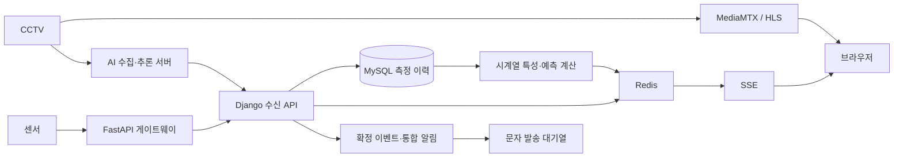

# 탄천 AI·센서 통합 모니터링

CCTV 영상, AI 부유물 측정, 가스 센서와 알림을 웹 화면에서 연결하는 모니터링 플랫폼입니다. 기존 [현장 CCTV 네트워크 작업](../tancheon-cctv-network-portfolio/tancheon-cctv-network-portfolio/)에서 영상 분석·데이터 수집·실시간 화면 연동으로 확장된 프로젝트 내용을 정리합니다.

> 2026-09-29 작성 / 2026-09-28 개발본 기준. 아래 표의 ‘구현’은 코드 확인을 뜻하며 현재 현장 장비의 정상 가동을 뜻하지 않습니다. 프로젝트 구현 범위를 기록하며 기능 전체의 개인 단독 저작을 주장하지 않습니다.

## 기술 구성

| 구분 | 구성 |
|---|---|
| 백엔드 | Django 5.2, ASGI/uvicorn |
| 데이터 | MySQL, Redis Pub/Sub·캐시 |
| 실시간 화면 | SSE, Django 템플릿, htmx, Chart.js |
| 영상 | MediaMTX의 RTSP → HLS 변환, 원본/AI 영상 선택 |
| 센서 게이트웨이 | FastAPI, RadioNode 측정값 파싱·전달 |
| 배포 구성 | Docker Compose, nginx 경로별 프록시 |
| AI 연계 | 외부 추론 결과 수신, 측정 이력, 이벤트, 예측값 표시 |

## 데이터 흐름

실제 호스트·포트·장치 ID와 운영 접속 경로는 생략했습니다.

## 확인한 구현

| 기능 | 구현 내용 | 코드 근거 |
|---|---|---|
| CCTV 재생 | 원본 HLS와 AI 분석 HLS 경로 선택, 목록·상세 화면 | CCTV 모델·뷰, 플레이어 및 템플릿 |
| AI 측정 수신 | 비율 정규화, 측정 이력 저장, 최신 상태 캐시 | `api/views.py` |
| 단계 판정 | 비율에 따른 단계 표시, 누적 측정으로 이벤트 확정, 쿨다운·상위 단계 처리 | `cctv/floating.py`, `api/views.py` |
| 실시간 갱신 | 채널별 Redis 구독을 SSE 클라이언트에 분배 | `core/broadcaster.py` |
| 센서 수집 | 장치 메시지를 항목별 값으로 변환하여 플랫폼 전달 | 센서 게이트웨이 `app/main.py` |
| 센서 저장 | 등록 센서·허용 항목 확인, 센서와 측정시각 기준 중복 저장 방지 | `sensor_datain` |
| 시계열 차트 | 카메라별 6시간·24시간·7일 비율 조회와 평균선 표시 | CCTV 뷰·상세 템플릿, 9월 28일 변경 기록 |
| 예측 연계 | 30분 내 경계 도달 확률과 30분 뒤 예상 면적 계산·캐시·전달 | `compute_predictions`, `cctv/risk.py` |
| 알림·문자 | 이벤트의 통합 피드 연결, 수신자별 발송 대기열·워커 구조 | 알림 모듈 및 개발 문서 |

## 설계에서 다룬 문제

### 순간 측정값과 확정 이벤트 구분

화면에는 최신 측정값을 전달하되, 알림은 단계별 측정을 누적해 확정한 경우에 발생하도록 구성했습니다. 같은 단계의 반복 알림은 쿨다운으로 제한하고 상위 단계 확정은 별도로 처리합니다. 측정·화면 표시와 실제 알림 발화를 분리한 설계입니다.

### 실시간 연결 수 관리

브라우저마다 Redis 구독을 만드는 대신 채널 구독을 공유하고 큐로 각 SSE 연결에 전달합니다. 구독자의 생성·이탈에 맞춰 백그라운드 작업 수명을 관리하며 느린 클라이언트의 큐가 가득 차면 해당 메시지를 버리는 정책이 있습니다. 정확한 처리량이나 무손실 전달을 보장하는 설계로 표현하지 않습니다.

### 센서와 플랫폼 연결

게이트웨이는 장치 메시지 파싱, XML 응답, 플랫폼 전달을 담당합니다. 플랫폼에서는 등록 센서의 측정 항목만 저장하고 동일 센서·시각 데이터는 갱신합니다. 원본 장치 식별값과 측정 로그는 공개하지 않습니다.

### 학습·서비스 특성 정의 일치

최근 31개 분 단위 평균으로 lag·이동 통계·기울기·시간·스캔 위상 특성을 계산합니다. 학습된 트리는 JSON에서 읽고 순수 Python으로 평가하는 구조입니다. 모델 파일이 없거나 측정 이력이 부족하면 예측값을 제공하지 않습니다. 플랫폼 코드에 연결돼 있다는 사실과 예측 품질 검증은 별개입니다.

## 구현·실험·미완성 구분

| 항목 | 상태와 한계 |
|---|---|
| 영상·AI·센서·SSE 연결 | 저장소에 구현 코드가 있음. 이번 작업에서 현장 네트워크나 운영 서버를 실행 검증하지 않음 |
| 예측값 연계 | 플랫폼 호출 코드와 모델 파일이 있음. 현장 정확도·안정성 검증 완료를 의미하지 않음 |
| 예측 모델 비교 | 별도 실험 코드와 결과가 있음. PTZ 이동·결측·수집 주기 변화 등 평가 제약 존재 |
| 센서 임계치 경보 | 개발 문서상 임계치 미정·자동 이벤트 생성 로직 미구현. 측정값 수집·저장과 구분 |
| 통계/알람 일부 | 개발 문서상 더미 표시가 남아 있음 |
| SMS | 문서상 실기능 검증용 임시 연결. 운영 알림 체계 완성으로 표현하지 않음 |
| 과거 장비 상태 기록 | 특정 날짜 점검 결과는 현재 가동 상태로 재사용하지 않음 |

## 공개 자료

- [AI 추론·재학습 평가](../tovnet-seg-portfolio/)
- [실제 구현에서 분리한 단계 판정·시계열 계산 예제](examples/README.md)
- [업데이트 근거와 공개 범위](../docs/UPDATE_2026-09-29.md)

전체 서비스 구동용 소스 배포본은 아닙니다. 운영 설정·현장 원자료·모델 가중치를 포함하지 않고, 독립적으로 확인 가능한 로직만 선별했습니다.
