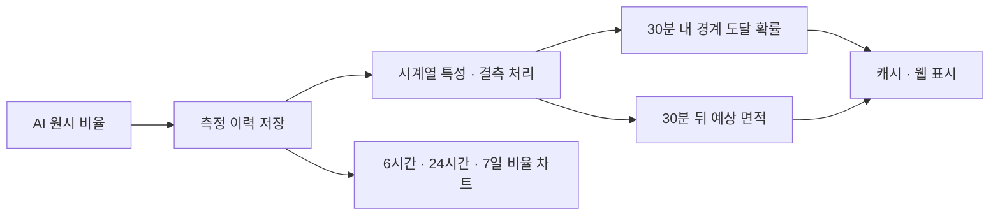

# 2. 중간발표 이후 — 현장 분석과 통합 모니터링으로 확장

[프로젝트 전체 흐름](README.md) · [1. 중간발표까지](01-before-interim.md)

이 단계는 기술 인수 이후의 개발을 **문제 → 구현 → 확인된 결과와 남은 작업** 순서로 설명합니다. AI 서버, 탄천 플랫폼, 예측 실험은 하나의 모니터링 시스템 안의 구성요소입니다. 아래 날짜는 개발 기록 기준이며 실제 배포일을 뜻하지 않습니다.

## 개발 흐름

| 개발 기록 시점 | 발전한 내용 |
|---|---|
| 8월 하순 | OneFormer 운영 추론 구조와 IR 모델 분기 |
| 9월 6~10일 | AI·플랫폼 연결, 원본 이미지와 마스크 저장, 측정 저장·예측 표시, 시간 후처리, 스트림·SSE 개선 |
| 9월 10~16일 | 시계열 예측 비교, 실측 기반 재학습, 이동 관련 특성·불확실성·검증 절차 보강 |
| 9월 18~21일 | 포함·제외 ROI, 현장 영상 수집·결측 대응, 평가 기준선 정리 |
| 9월 22~28일 | 재학습 v1~v3와 비교 평가, 비율 이력 차트·센서 처리 보강 |

## 2-1. 입력과 출력: 지속적으로 관측할 수 있게

**문제:** 연결이 끊기거나 화면 갱신이 늦으면 분석 결과가 최신인지 판단하기 어렵습니다. 이미지 색상·영상 인코딩·브라우저 연결 문제도 모델 바깥에서 발생합니다.

**구현:** RTSP/FFmpeg 입력과 HLS 출력을 분리하고, 원본 스냅샷의 RGB/BGR 처리, 압축 마스크 저장, 이벤트 전 이미지 이력과 보관 처리를 보강했습니다. CPU HLS 인코딩과 리사이즈 JPEG 캐시, 브라우저 초기 수신·SSE 재연결 경로를 개선했습니다. 마지막 프레임을 사용하는 경우 오래된 상태를 구분하는 처리도 추가됐습니다.

**확인 범위:** 관련 코드와 개발 기록을 확인했습니다. 이번 포트폴리오 갱신에서 현장 스트림의 가동률이나 종단 지연시간을 새로 측정하지는 않았습니다.

## 2-2. 마스크와 ROI: 비율이 변한 이유를 구분하기

**문제:** 프레임마다 마스크가 흔들리고, 이전 마스크를 오래 유지하면 잔상이 생깁니다. PTZ 이동과 관측 영역 변화는 실제 부유물 증가와 다른 원인으로 비율을 바꿀 수 있습니다.

**구현:**
- 시간 기반 마스크 유지·히스테리시스와 근거리·원거리 유지 처리를 조정했습니다.
- 포함 ROI와 제외 ROI를 도입하고, 고정된 수면 ROI와 제외 영역만 사용하는 관측 방식의 분모 차이를 구분했습니다.
- 원시 비율과 평활화된 비율을 나눠 계산하고, 마스크 중심·이동·장면 차이·PTZ 관련 특성을 추출합니다.
- 추론 엔진에는 1920×1080 프레임을 아래쪽으로 패딩해 1920×1088에서 처리한 뒤 크롭하는 경로가 있습니다.

**남은 해석:** ROI 설정과 PTZ 방향에 따라 면적 비율의 의미가 달라집니다. 임의 해상도·CPU 추론·모든 촬영 조건을 검증했다고 표현하지 않습니다.

## 2-3. 측정 저장에서 30분 예측 표시까지

**문제:** 현재 프레임만 보여주면 과거 변화와 가까운 미래의 부유물 증가 가능성을 함께 보기 어렵습니다.

**구현 흐름:**

예측 실험은 persistence·기울기 기준선, Chronos, LightGBM 등의 비교에서 출발했습니다. 이후 실제 측정값, 이동 관련 공변량, PTZ 주기의 사인·코사인 특성, 불확실성 보정과 검증 절차를 보강했습니다. 최신 플랫폼에는 최근 이력으로 예측을 계산하고 캐시해 표시하는 경로가 있으므로, 단순히 “실험만 존재한다”고 설명하지 않습니다.

재학습 스크립트는 최근 검증 구간을 따로 두고 후보의 AP·MAE를 기존 모델과 비교합니다. 검증 통과에 따른 산출물 갱신과 실제 서비스 모델 배포를 구분합니다. 모델이나 측정 이력이 부족할 때는 예측을 표시하지 않는 경로도 있습니다.

**확인 범위:** 측정 저장·계산·표시 연결과 검증 코드가 존재합니다. 실제 현장의 예측 품질, 장기 교정 상태, 모델 교체 완료까지 보장하는 자료는 아닙니다.

## 2-4. 재학습: IoU와 오탐을 함께 평가하기

**문제:** 현장의 슬러지·녹조, 반사와 오탐 사례를 기존 모델이 충분히 다루는지 확인해야 합니다.

| 실험 흐름 | 주요 변경·검토 |
|---|---|
| v1 | 백본 고정, 수작업 라벨과 오탐 사례를 활용한 기준 실험 |
| v2 | 증강과 선별한 의사 라벨 활용 |
| v3 | 전체 백본 학습 및 기본 증강을 적용한 후보 비교 |
| 비교 평가 | 기존 시험셋·수작업 검증셋·오탐 사례 holdout을 각각 확인 |

| 평가셋 | 부유물 IoU 기존 → v3 | 배경 오탐률(%) 기존 → v3 |
|---|---:|---:|
| 기존 시험셋 | 0.4156 → 0.4817 | 2.406 → 0.799 |
| 수작업 검증셋 | 0.5492 → 0.7338 | 0.695 → 1.749 |
| 오탐 사례 holdout | 0.1214 → 0.2872 | 0.582 → 0.107 |

IoU는 정답 부유물이 있는 프레임만의 평균이며 전체 클래스 mIoU가 아닙니다. 수작업 검증셋에서는 평균 예측 면적도 9.25% → 13.09%로 증가했습니다. 경보가 면적 비율에 의존하므로 **영역 검출 개선과 과다 검출의 영향을 함께 검토**해야 합니다.

[평가 조건·해석](EVALUATION.md)과 [집계 결과](evidence/retrain-v3-summary.json)는 저장된 비교 기록을 정리한 것입니다. 이번 작업에서 GPU 평가를 다시 실행하지 않았고, v3 운영 배포 완료로 해석하지 않습니다.

## 2-5. 운영 화면: 영상·센서·이벤트를 함께 보기

플랫폼은 AI 측정값 저장, CCTV 영상과 원본·분석 화면, 비율 차트, 이벤트 및 SSE 갱신을 연결합니다. 센서 수신은 센서·시각 기준 중복 처리를 고려한 저장과 정규화·전달 경로가 있습니다. 알림 관련 코드에는 SMS와 카카오 연계가 포함됩니다.

| 영역 | 확인한 상태 | 구분할 점 |
|---|---|---|
| AI 측정 | 수신·저장·차트·예측 표시 코드 | 현장 장기 품질 평가와 별개 |
| 실시간 화면 | SSE 전달·재연결 처리 | 지속 가동률 재측정은 하지 않음 |
| 센서 | 수집·저장·정규화·전달 | 임계치 기반 센서 이벤트는 개발 문서상 미완성 |
| 알림 | 채널 연결과 발송 관련 코드 | SMS는 개발 검증용 연결; 운영 발송 성공을 일괄 주장하지 않음 |
| 통계 | 일부 실제 측정 조회 | 알람 통계 일부는 더미 구성으로 추가 구현 필요 |

## 직접 살펴볼 수 있는 공개 코드

[계산 코드와 합성 예제](examples/README.md)는 비율 정규화·단계 확정·예측 특성·트리 계산처럼 운영 자격증명 없이 검토할 수 있는 부분을 분리했습니다. 실제 측정값·모델·현장 식별자는 포함하지 않습니다.

이 단계의 성과는 “모든 기능을 완성했다”가 아니라, **영상 분석을 실제 관측 흐름에 연결하고, 재학습 결과와 미완성 구간을 근거로 설명할 수 있게 확장한 것**입니다.
