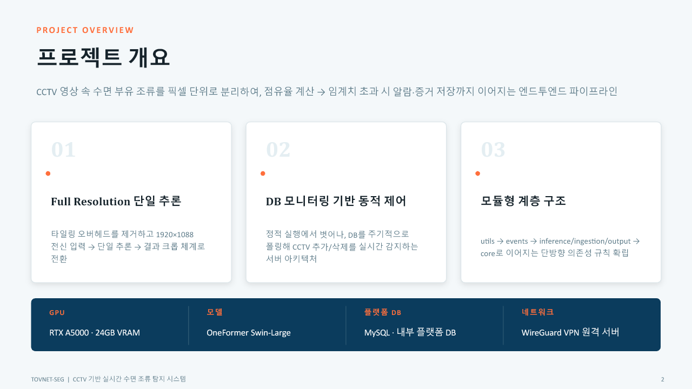
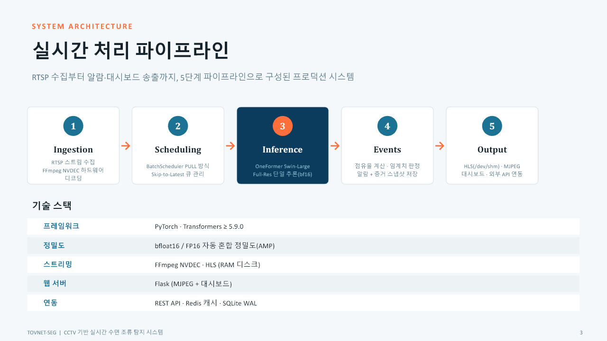
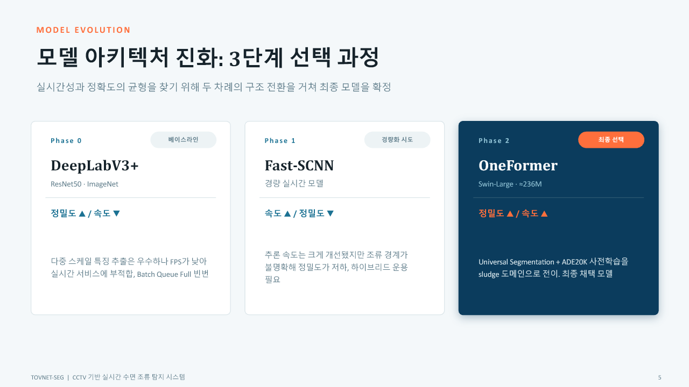
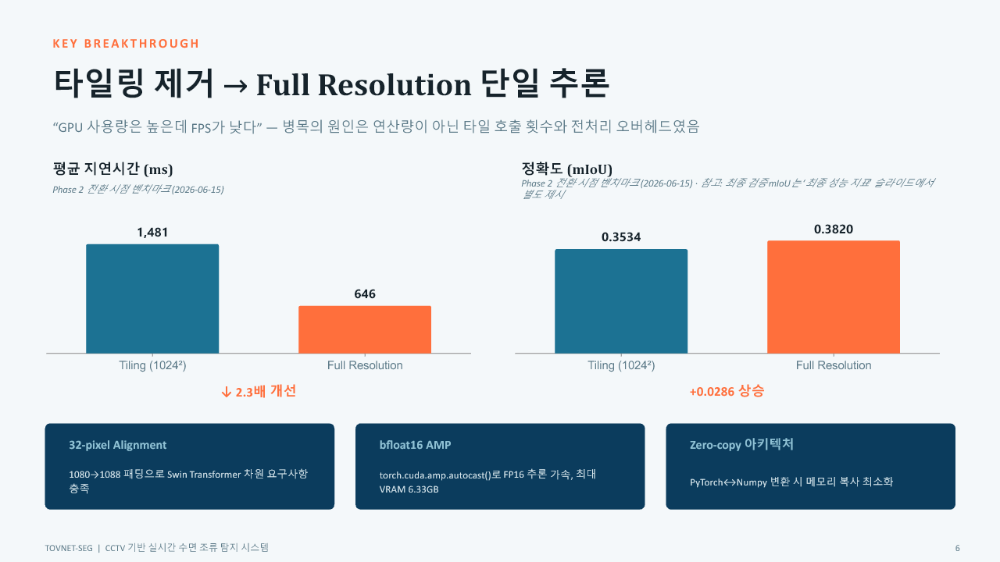
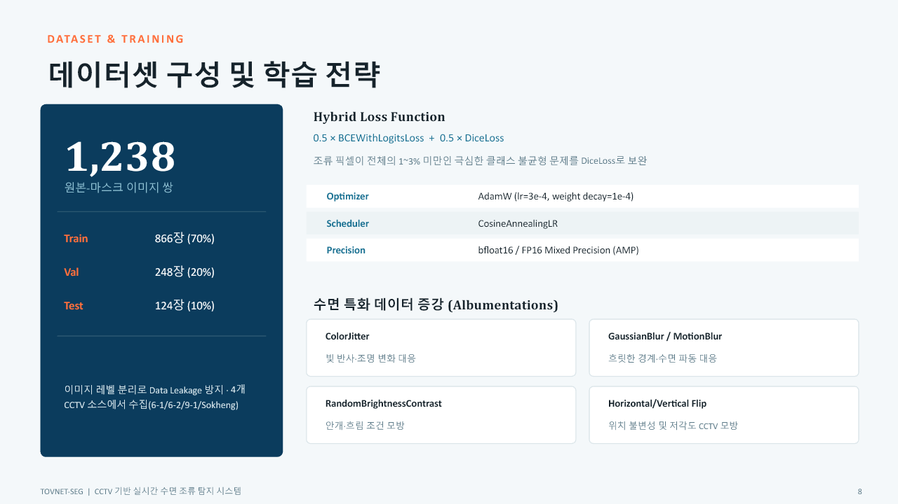
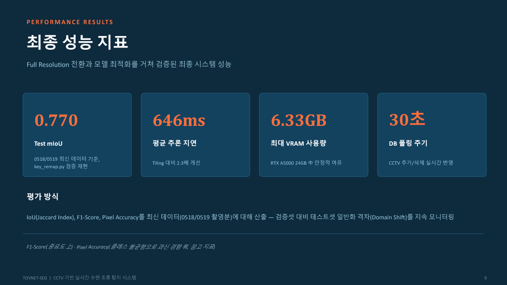
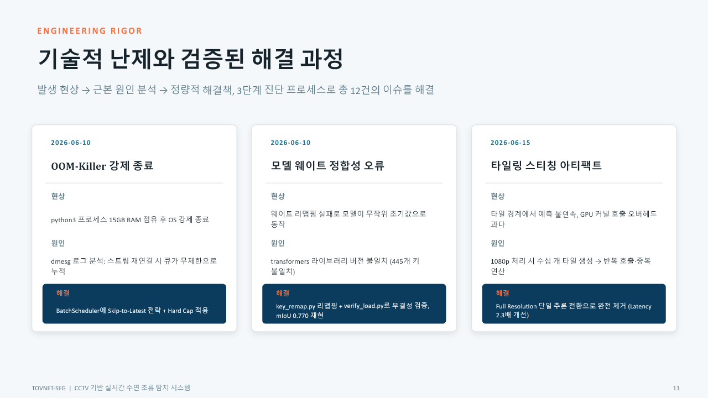
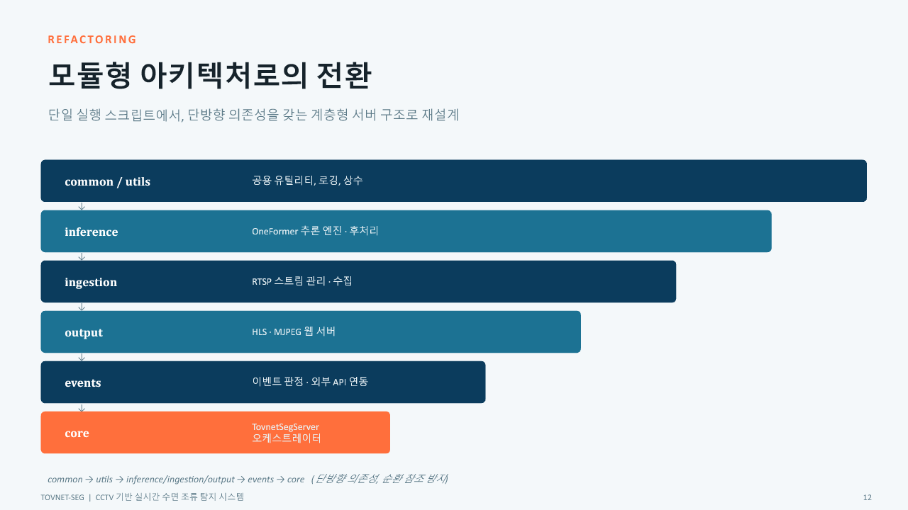
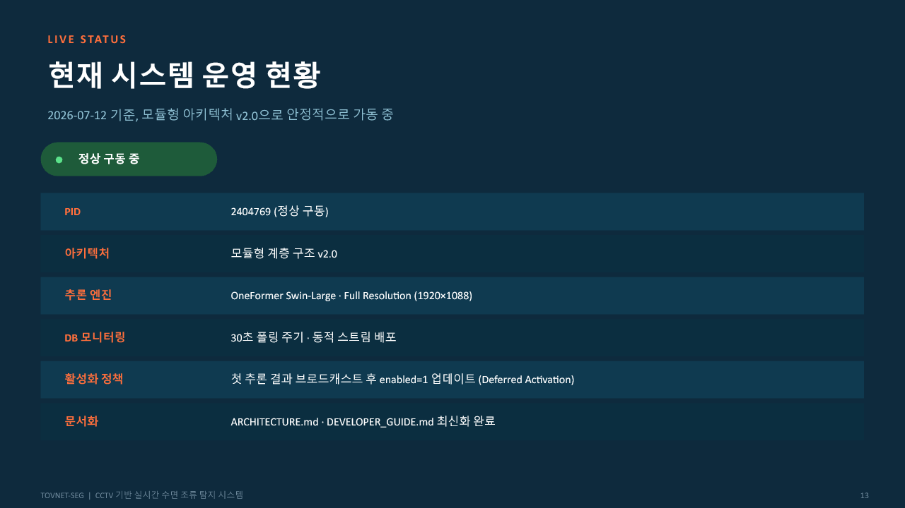
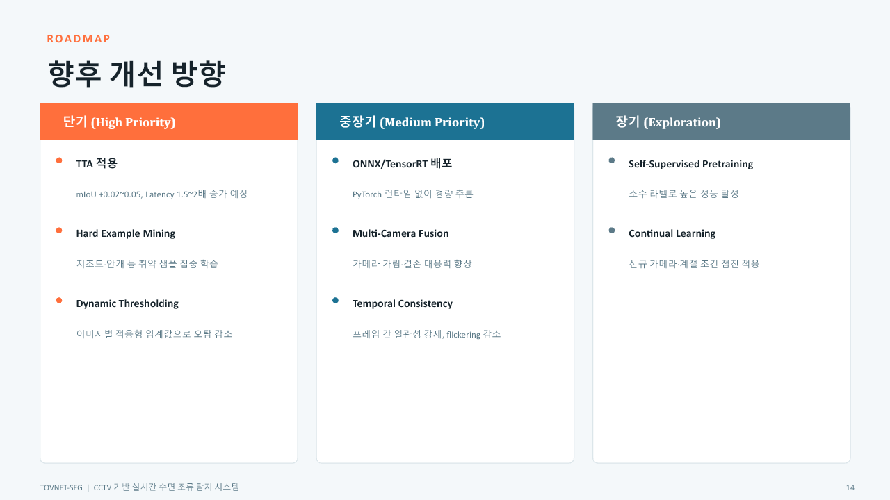

# TOVNET-SEG | CCTV 기반 수면 조류 세그멘테이션 시스템

정부과제로 개발된 CCTV 기반 수면 조류 분석 시스템의 기술자료를 인수하여, 전체 AI 파이프라인을 분석하고 정부과제 발표를 수행했습니다. 현재는 운영 이슈를 정리하면서 유지보수와 현장 고도화 방향을 검토하고 있습니다.

## Portfolio Files

- [발표자료 PDF](TOVNET-SEG_기술인수_발표포트폴리오_양호용.pdf) - GitHub에서 바로 열람
- [발표자료 PPTX](TOVNET-SEG_기술인수_발표포트폴리오_양호용.pptx) - 원본 슬라이드 다운로드
- `assets/` - README에 사용한 대표 슬라이드 이미지

## Project Overview

| 구분 | 내용 |
|---|---|
| 프로젝트 | CCTV 기반 수면 조류 세그멘테이션 시스템 |
| 과제 성격 | 정부과제 연구개발 결과물 |
| 원개발 주도 | 성균관대학교 연구진 |
| 개인 역할 | 기술자료 인수·분석, 정부과제 발표, 운영 이슈 분석, 유지보수·고도화 방향 검토 |
| AI 분야 | Semantic Segmentation, Vision AI |
| 모델 | OneFormer + Swin-Large |
| 입력 | RTSP CCTV 영상 |
| 출력 | 조류 마스크, 면적·점유율, 관제 연동 데이터 |
| 확장 | Raspberry Pi·멀티스펙트럼 카메라 현장 연동 검토 |

> 모델을 처음부터 단독 개발했다고 주장하지 않습니다. 원개발 결과물을 인수하여 구조를 파악하고, 발표·운영·유지보수·고도화 관점에서 발전시키는 역할을 수행했습니다.

## System Pipeline

1. RTSP CCTV 스트림 수집
2. 프레임 스케줄링과 전처리
3. GPU 기반 OneFormer 추론
4. 마스크 후처리와 조류 면적·점유율 계산
5. 이벤트 생성과 DB 기록
6. 관제 플랫폼에 REST API·MQTT 방식으로 결과 전송

기술 인수 과정에서는 모델만 확인한 것이 아니라 영상 입력, 추론, 후처리, 이벤트, 외부 시스템 출력으로 이어지는 전체 운영 흐름을 분석했습니다.

## Model Selection

개발 기록에는 다음과 같은 모델 전환 과정이 정리되어 있습니다.

- DeepLabV3+: 초기 정확도 기준선 확인
- Fast-SCNN: 실시간 처리 가능성을 위한 경량 모델 검토
- OneFormer + Swin-Large: 복잡한 수면·조류 경계 표현과 성능 확보를 위해 최종 채택

저는 이 전환 과정을 발표자료로 재구성하면서 각 모델의 선택 이유와 현장 적용 시 장단점을 설명했습니다.

## Performance Improvement

- Tiling 추론 지연시간: 1,481 ms
- Full Resolution 추론 지연시간: 646 ms
- 문서 기록 기준 mIoU: 0.3534 → 0.3820
- 약 2.3배 수준의 추론 지연시간 개선

타일링 방식에서 발생하는 반복 연산을 줄이고 Full Resolution 단일 추론 방식으로 전환한 과정을 분석했습니다. 성능 수치는 기술 인수 문서에 기록된 평가 결과이며 개인 단독 성과로 표시하지 않습니다.

## Dataset & Training

- 총 1,238장 규모의 학습 데이터 기록
- Train / Validation / Test 분리
- Albumentations 기반 데이터 증강
- Hybrid Loss 구성 분석
- Optimizer, Scheduler, Precision 설정 검토

데이터 수량만 확인하지 않고 데이터 분할, 증강, 손실함수, 학습 설정이 결과에 어떤 영향을 주는지 기술자료를 기반으로 정리했습니다.

## Performance Evidence

기술자료에 기록된 대표 운영 지표는 다음과 같습니다.

- Test mIoU: 0.770
- 평균 추론 지연시간: 646 ms
- 최대 VRAM 사용량: 6.33 GB
- DB 동기화 주기: 30초

평가 범위와 시점에 따라 mIoU 수치가 다르게 기록되어 있어, 포트폴리오에서는 수치를 임의로 합치지 않고 각 자료의 평가 조건에 따른 기록으로 구분합니다.

## Engineering & Troubleshooting

운영 기록을 검토하면서 다음 문제와 대응 방향을 분석했습니다.

- RTSP 장시간 수집 과정의 메모리 증가와 OOM 문제
- 라이브러리 버전 차이로 인한 모델 체크포인트 호환성 문제
- FFmpeg 프로세스 종료와 포트·자원 회수 문제
- 연결 직후 정상 표시와 실제 첫 추론 성공 시점의 불일치
- 서버 재시작과 장애 복구 시 상태 동기화 문제

이 경험을 통해 모델 정확도뿐 아니라 프로세스 수명주기, 메모리, 스트림 재연결, 상태 관리가 현장 AI 서비스에서 중요하다는 점을 학습했습니다.

## Architecture Review

시스템을 `ingestion`, `inference`, `output`, `events`, `core/common` 영역으로 나누어 분석했습니다. 이를 바탕으로 장애가 발생했을 때 모델 자체 문제인지, 영상 입력 문제인지, 후처리·DB·외부 전송 문제인지 구분할 수 있는 관점을 확보했습니다.

## Current Operation & Roadmap

### 단기

- RTSP 재연결 안정화
- 메모리 증가 원인 분석과 장시간 운영 테스트
- 프로세스 상태와 첫 추론 성공 상태 구분
- 운영 로그와 예외 처리 보완

### 중기

- Raspberry Pi 기반 엣지 입력 장치 연동
- 멀티스펙트럼 카메라 데이터 수집·분석
- 현장 CCTV와 스펙트럼 데이터 비교
- 관제 플랫폼 출력 형식 정비

### 장기

- Self-supervised Pretraining 검토
- Continual Learning과 현장 데이터 기반 재학습 체계 검토
- Edge AI 추론 최적화

## What I Can Contribute

- 낯선 AI 연구 결과물과 코드를 인수하고 전체 구조를 빠르게 파악할 수 있습니다.
- 모델 성능지표를 단순 나열하지 않고 평가 조건과 운영 환경을 함께 해석합니다.
- RTSP 영상 입력부터 AI 추론, DB·API·관제 출력까지 전체 파이프라인을 설명할 수 있습니다.
- 정부과제 발표 경험을 바탕으로 복잡한 기술 내용을 이해관계자에게 전달할 수 있습니다.
- Raspberry Pi와 멀티스펙트럼 카메라를 활용해 기존 서버형 AI를 현장형 Edge·IoT 연구로 확장하고 있습니다.

## Privacy Notice

공개 저장소에는 DB 접속정보, 비밀번호, 토큰, 실제 서버 IP, 개인 연락처와 계정정보를 포함하지 않습니다. 모델 구조, 성능지표, 시스템 기능, 공개 가능한 정부과제 기술 내용은 포트폴리오 설명을 위해 유지했습니다.
