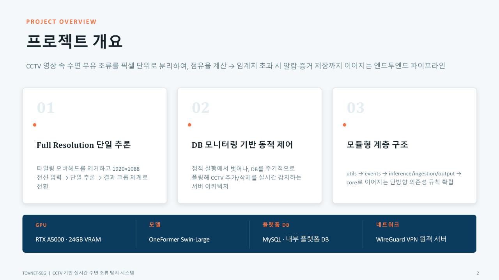
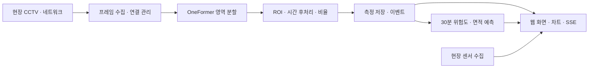

# TOVNET-SEG · 탄천 통합 모니터링
## AI 영상 분석부터 예측·모니터링 플랫폼까지 전체 설계·개발

CCTV 영상에서 수면의 슬러지·녹조 영역을 분석하고, 결과를 현장 모니터링과 연결하는 **하나의 프로젝트가 발전한 과정**입니다. AI 분석, 탄천 웹 플랫폼, 현장 네트워크 작업을 이 흐름 안에서 함께 설명합니다.

| 단계 | 출발점과 해결할 문제 | 결과 |
|---|---|---|
| **[1. 중간발표까지](01-before-interim.md)** | 영상 입력·모델 적용·추론 파이프라인과 현장 연결 구현 | AI 영상 분석 시스템 개발, 처리 방식 비교와 중간발표 |
| **[2. 중간발표 이후](02-after-interim.md)** | 현장 영상의 흔들림·오탐·누락, 결과 저장과 운영 화면 연결 | ROI·시간 후처리, 재학습 비교, 측정 저장·30분 예측·차트·센서 연계 |

단계 1은 기존 발표자료를 기준으로 삼았습니다. 발표일을 임의로 지정하지 않았으며, 단계 2의 날짜는 후속 개발 기록의 날짜입니다. 2026-09-29 확인 기준으로 구현·실험·남은 작업을 구분합니다.

## 전체 시스템

```mermaid
flowchart LR
    A["현장 CCTV · 네트워크"] --> B["프레임 수집 · 연결 관리"]
    B --> C["OneFormer 영역 분할"]
    C --> D["ROI · 시간 후처리 · 비율"]
    D --> E["측정 저장 · 이벤트"]
    E --> F["30분 위험도 · 면적 예측"]
    E --> G["웹 화면 · 차트 · SSE"]
    F --> G
    H["현장 센서 수집"] --> G
```

핵심 변화는 모델 출력에서 끝나던 설명을 **영상 입력 → 분석 → 저장 → 예측 → 사용자 확인**의 전체 흐름으로 확장한 것입니다. “river flood”라는 개발 저장소 이름과 별개로, 여기서 평가하는 예측 대상은 부유물 비율입니다. 하천 수위나 홍수 예측 성능으로 표현하지 않습니다.

## 현재까지 확인한 내용

- **영상 분석:** OneFormer + Swin-Large 추론, 입력 수집·추론·이벤트·출력 모듈 분리.
- **현장 대응:** 마스크 시간 후처리, 포함·제외 ROI, PTZ 이동 관련 특성, 스트림·스냅샷 처리 개선.
- **학습과 검증:** 수작업 라벨·오탐 사례·의사 라벨을 활용한 v1~v3 실험과 기존 모델 비교.
- **서비스 연결:** 원시 측정 저장, 비율 이력 차트, 30분 위험도·면적 예측 계산, SSE 갱신, 센서 수집.
- **남은 구분:** 후보 모델 평가와 실제 배포, 센서 수집과 센서 임계 경보, 알림 연결 코드와 운영 발송 검증은 각각 별개입니다.

## 결과를 어떻게 읽는가

v3 후보의 부유물 IoU는 세 평가셋에서 상승했지만, 수작업 검증셋의 배경 오탐률은 **0.695% → 1.749%**로 증가했습니다. 비율로 경보를 생성하므로 IoU만으로 운영 개선을 단정하지 않습니다.

[조건과 전체 평가표](EVALUATION.md) · [집계 JSON](evidence/retrain-v3-summary.json) · [공개 가능한 계산 코드와 합성 예제](examples/README.md)

## 자료와 기여 범위

- [1단계: 중간발표까지](01-before-interim.md)
- [2단계: 중간발표 이후](02-after-interim.md)
- [두 단계로 설명하는 발표 스크립트](PRESENTATION_SCRIPT.md)
- [기존 발표 PDF](TOVNET-SEG_기술인수_발표포트폴리오_양호용.pdf) / [PPTX](TOVNET-SEG_기술인수_발표포트폴리오_양호용.pptx)

**담당: 양호용 — 탄천 AI 영상 분석·모니터링 시스템 전체 설계 및 개발.** 영상 수집·추론 파이프라인, ROI·시간 후처리, 모델 재학습·평가, 측정 저장·30분 예측, 웹 모니터링·센서·알림 연계와 현장 연결을 직접 개발했습니다.

OneFormer·Swin 등 기반 모델과 라이브러리를 활용해 현장 시스템을 구현했습니다. 기반 기술의 출처와 이를 활용한 시스템 개발 기여를 구분합니다. 기존 발표자료의 파일명은 보존했으며, 현재 역할 설명은 이 문서를 기준으로 합니다.

원본 현장 영상·학습 데이터·모델 가중치·운영 접속정보는 공개하지 않습니다.
